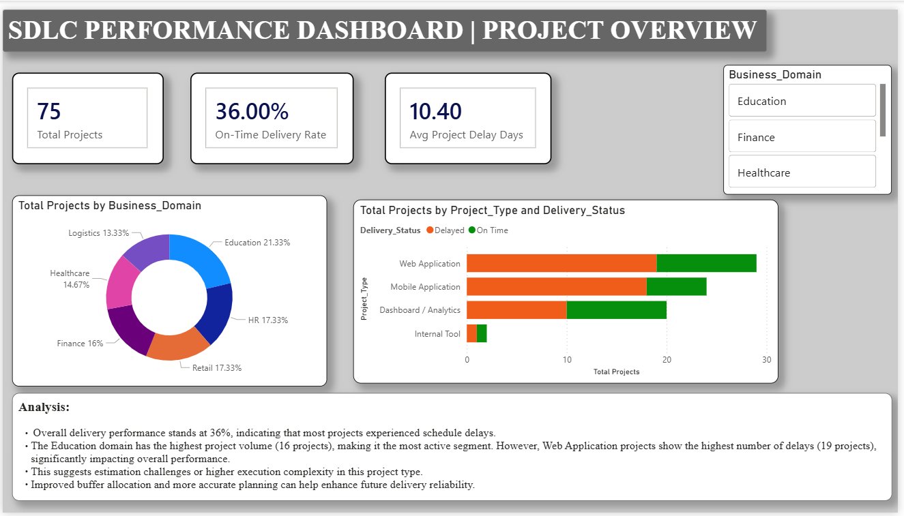

# SDLC Efficiency and Performance Analysis

## Project Overview
This project analyzes the efficiency of the Software Development Life Cycle (SDLC) using structured data analytics techniques. The objective of the project is to evaluate how different SDLC phases perform in terms of time utilization, delay patterns, and resource allocation.

The analysis was carried out during an internship at Helsy Infotech Pvt. Ltd. The dataset used in this project was anonymized and synthetically generated under mentor supervision due to organizational data confidentiality policies.

The project applies Python-based analysis and Power BI visualization to measure project execution performance using Key Performance Indicators (KPIs).

---

# Project Objectives
The main objectives of this project are:

- To analyze software project performance using structured SDLC data
- To compare planned project timelines with actual execution timelines
- To identify SDLC phases contributing most to project delays
- To evaluate resource utilization patterns across projects
- To implement measurable KPIs for project performance monitoring
- To build an interactive Power BI dashboard for visual analysis

---

# Dataset Description
The project uses structured datasets representing simulated organizational project records.

The dataset includes three main tables:

## 1. Project_Master
Contains high-level information about each software project.

Main attributes:
- Project_ID
- Project_Name
- Project_Type
- Business_Domain
- Team_Size
- Project_Status
- Delivery_Status

## 2. Phase_Activity
Tracks SDLC phase execution details.

Main attributes:
- Project_ID
- Phase_Name
- Phase_Start_Date
- Phase_End_Date
- Planned_Hrs
- Actual_Hrs
- Phase_Status
- Delay_Flag
- Rework_Required

## 3. Resource_Allocation
Contains information about employee assignment and workload distribution.

Main attributes:
- Resource_ID
- Project_ID
- Employee_ID
- Role
- Planned_Hours
- Actual_Hours
- Utilization_Status

---

# Technologies Used

- Python
- Jupyter Notebook
- Pandas
- Matplotlib
- Power BI
- Microsoft Excel

Python was used for data preprocessing, KPI calculation, and analytical implementation, while Power BI was used to develop the dashboard for performance visualization.

---

# Project Workflow

The analysis followed a structured workflow:

1. Dataset Import and Validation  
2. Data Cleaning and Preprocessing  
3. Exploratory Data Analysis (EDA)  
4. Phase-wise Delay Calculation  
5. KPI Implementation  
6. Trend Analysis  
7. Dashboard Visualization in Power BI  

---

# Key Performance Indicators (KPIs)

The project implements multiple KPIs to measure SDLC efficiency, including:

- On-Time Delivery Rate
- Average Project Delay
- Phase Delay Contribution
- Planned vs Actual Effort Analysis
- Resource Utilization Rate
- Project Completion Trends
- Phase Efficiency Distribution

These KPIs help identify performance gaps in software project execution.

---

# Key Insights

The analysis produced several important findings:

- Only about **36% of projects were completed on time**
- Average project delay was approximately **10.4 days**
- The **Requirement phase and Deployment phase** contributed most to delays
- Development and Testing phases generally stayed close to planned timelines
- Resource overutilization was observed in many project assignments

These insights indicate that project delays are more related to planning and release coordination rather than development inefficiencies.

---

# Dashboard

A Power BI dashboard was created to visualize SDLC performance metrics.

Dashboard pages include:

- Project Performance Overview
- Phase Delay Analysis
- Resource Utilization Analysis
- SDLC Trend Monitoring

The dashboard converts analytical results into visual insights that can support project monitoring and management decisions.

---

# Repository Structure
SDLC-Efficiency-Analysis
│
├── data
│ ├── project_master.csv
│ ├── sdlc_phase_tracking.csv
│ └── resource_allocation.csv
│
├── notebooks
│ └── SDLC Efficiency and Performance Analysis.ipynb
│
├── dashboard
│ └── SDLC_Performance_Dashboard.pbix
│
└── README.md

---

# How to Run the Project

1. Clone the repository
2. Install required Python libraries
3. Open the Jupyter Notebook
4. Run all cells to reproduce the analysis

Required libraries:
pandas
numpy
matplotlib

---

# Future Scope

Possible future improvements include:

- Integration with project management tools such as Jira
- Real-time data pipeline instead of static CSV datasets
- Predictive modeling for delay forecasting
- Automated resource allocation recommendations
- Cloud deployment of dashboards

  ## Project Dashboard Preview

Power BI dashboard created to visualize SDLC project performance and phase delay analysis.

---

# Author

**Mrunali Jadav**  

